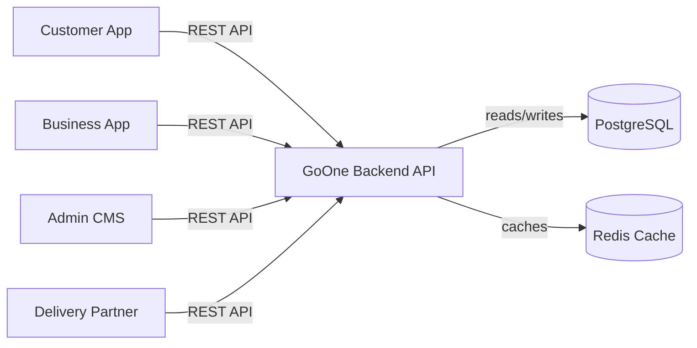
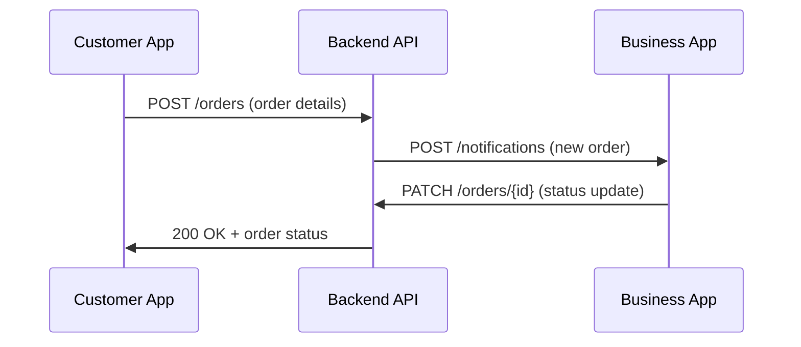

# goone-customer-app
GoOne Customer Mobile Application
## goone-customer-app/README.md

# GoOne Customer App

**Description:** The GoOne Customer App is a React Native mobile application for customers to browse local businesses, place orders, and track deliveries. It targets both urban and rural users (including first-time smartphone users).  
**Tagline:** One App. One Community. Unlimited Opportunities.

[](#) [](#) [](#)

## Table of Contents

- [Quick Start](#quick-start)  
- [Architecture](#architecture)  
- [Screen Flow (Order)](#screen-flow-order)  
- [Folder Structure](#folder-structure)  
- [Key Scripts](#key-scripts)  
- [Environment Variables](#environment-variables)  
- [Building and Testing](#building-and-testing)  
- [CI/CD](#cicd)  
- [Deployment](#deployment)  
- [Accessibility](#accessibility)  
- [Contributing](#contributing)  
- [Issue Templates](#issue-templates)  
- [Security](#security)  
- [License](#license)  
- [Maintainers & Contacts](#maintainers--contacts)  
- [ADR & Docs](#adr--docs)  
- [Design](#design)

## Quick Start

1. **Prerequisites:** Install Node.js (16+), Yarn, Android Studio (with SDK), Xcode (for iOS), and JDK 11+. See [documentation on prerequisites and OS support](docs/prereqs.md).  
2. **Clone and Install:**  
   ```bash
   git clone https://github.com/your-org/goone-customer-app.git
   cd goone-customer-app
   yarn install
   ```  
3. **Configure:** Copy `.env.example` to `.env` and fill in required variables (see [Environment Variables](#environment-variables)).  
4. **Run (Development):**  
   - Android: `yarn android` (starts Metro bundler and Android emulator)  
   - iOS: `cd ios && pod install && cd .. && yarn ios` (requires Xcode)  
5. **Run (Production Preview):** Use `yarn build:android` or `yarn build:ios` and install the APK/IPA on a device.  
6. **Reference:** Include a brief usage example near the top as recommended (e.g. app start command).  

*(Many quick-start guides recommend leading with a copy-paste example to reduce onboarding time.)*

## Architecture

The Customer App communicates with the GoOne Backend over HTTPS. Below is a simplified architecture diagram. It shows the Customer App and other clients connecting to the Backend API and shared database.



*Figure: System Architecture (Mermaid graph, for illustration)*

Use the architecture section to show how data and requests flow through the system.  Mermaids or similar diagrams help users understand the system without diving into code.

## Screen Flow (Order)

The sequence below illustrates an order placement flow. For example, when a customer places an order, the app calls the backend, which notifies the business app, and updates the customer with the result:



*Figure: Sequence diagram for order placement.* 

This demonstrates the core message flow. Every component’s responsibility should be clear alongside the diagram (labels above help clarity).

## Folder Structure

Include a concise project structure to help locate key code. For example:

```
goone-customer-app/
├── android/           # Android native code
├── ios/               # iOS native code
├── src/
│   ├── components/    # Reusable UI components
│   ├── screens/       # App screens (home, product, checkout, etc.)
│   ├── navigation/    # React Navigation setup
│   ├── services/      # API calls, business logic
│   ├── utils/         # Utilities, helpers
│   ├── assets/        # Images, fonts, etc.
│   └── App.js         # Root component
├── .env.example       # Sample environment variables
├── package.json
└── README.md          # This file
```

_Do not list every file. Only show what helps a new contributor navigate the code._

## Key Scripts

- `yarn start` – Start Metro bundler (development server).  
- `yarn android` / `yarn ios` – Launch app on Android emulator or iOS simulator.  
- `yarn test` – Run Jest unit tests (no tests: list as limitation or TODO).  
- `yarn lint` – Run ESLint & Prettier (ensure consistent code style).  

These scripts should match the `package.json` scripts section. Ensure cross-platform commands (use [cross-env](https://www.npmjs.com/package/cross-env) if needed for env vars).

## Environment Variables

All secrets and config are managed via `.env` (not checked into Git). List each variable and its purpose (required vs optional). For example:

```env
API_BASE_URL=https://api.goone.example    # Backend API endpoint
GOOGLE_MAPS_API_KEY=                      # (optional) Google Maps key for location services
NODE_ENV=development                      # Set to production in production builds
```

Provide a sample `.env.example` as above. This follows best practice of documenting each external input, including environment variables.

## Building and Testing

- **Android:** Use Android Studio or Gradle CLI. (If using Expo, skip this.)  
- **iOS:** Use Xcode (open `ios/GoOne.xcworkspace`, then build).  
- **Testing:** Implement unit tests with [Jest](https://jestjs.io/) and [React Native Testing Library](https://testing-library.com/docs/react-native-testing-library/intro). Example:  
  ```bash
  yarn test
  ```  
  If tests are not yet added, note it as a limitation. Regardless, tests should be runnable with a single command.  

Using Jest (or Mocha/Jasmine) and ensuring some automated tests is strongly recommended. Add linting (`yarn lint`) in CI to catch style issues early.

## CI/CD

A CI workflow should run on every push/PR. It must install dependencies, run lint and tests, and prevent merging on failure. For example, a GitHub Actions workflow (`.github/workflows/ci.yml`) might include:

```yaml
name: CI
on: [push, pull_request]
jobs:
  build:
    runs-on: ubuntu-latest
    steps:
      - uses: actions/checkout@v4
      - name: Setup Node.js
        uses: actions/setup-node@v4
        with:
          node-version: '16'
      - name: Install Dependencies
        run: yarn install
      - name: Lint Code
        run: yarn lint
      - name: Run Tests
        run: yarn test
```

When a check fails, the merge should be blocked. This reflects best practice: “automated tests at every stage”. If deployment is automated (e.g. publishing to app stores), document it here and provide workflow links.

**Secrets:** Store any API keys, keystore passwords, and certificates in CI secrets (e.g. GitHub Secrets). *Never* hardcode secrets in the repo.

## Deployment

Mobile apps are typically deployed via App Stores. For CI/CD, you might use Fastlane or Expo Application Services. Document the steps to release a new version (e.g., bumping version, generating builds, uploading). If the app has a public demo or beta link, place it here. Also mention any staging environments.  

If using Docker for some part (like static analysis), add a `docker-compose.yml`. Example:

```yaml
version: '3.8'
services:
  db:
    image: postgres:15
    environment:
      POSTGRES_DB: goone
      POSTGRES_USER: goone_user
      POSTGRES_PASSWORD: example
    volumes:
      - db-data:/var/lib/postgresql/data
volumes:
  db-data:
```

*(This is just an example for backend stack; adapt as needed.)*

## Accessibility

Ensure one-hand usage: design UI so key actions are reachable by thumb. Use large touch targets and high-contrast text/icons for rural audiences. For example, buttons should be at least 48dp high. Mention any accessibility audits or tools used (e.g. React Native Accessibility, inclusive fonts). 

## Contributing

Contributions are welcome. Outline how to file issues and open pull requests. For example:  

- **Issues:** Use GitHub Issue templates to report bugs or suggest features (see [Issue Templates](#issue-templates)).  
- **Pull Requests:** Branch from `main`, follow commit message conventions (e.g. [Conventional Commits](https://www.conventionalcommits.org)).  
- **Standards:** Follow the [code style & linting rules](#key-scripts) (run `yarn lint`).  

If more detailed, link to a separate `CONTRIBUTING.md`. This “enables contribution” by explaining how to contribute.

## Issue Templates

Use GitHub issue templates in `.github/ISSUE_TEMPLATE/` (for bug reports, feature requests, etc.). Templates ensure contributors provide needed info (see GitHub docs). Encourage use of templates to improve issue clarity.

## Security

Keep secrets out of code. Do *not* commit any credentials or `.env` to Git. Use environment variables and CI/CD secrets. Consider adding a `SECURITY.md` file describing how to report vulnerabilities. Run dependency scans (e.g. `npm audit`) and update libraries regularly. A security checklist might include: enabling two-factor auth on repos, reviewing third-party libraries, and periodic code scanning.

## License

This project is open-source under the MIT License. See the [LICENSE](../LICENSE) file for details. Including the license upfront tells users the terms of use.

## Maintainers & Contacts

- **Lead Developer:** Alice Example (alice@example.com)  
- **Mobile Team:** Bob Developer (bob@example.com), Carol Dev (carol@example.com)  
- **UX Designer:** Dana Designer (dana@example.com)  

For other roles, see [MAINTAINERS.md](MAINTAINERS.md) or contact the team via our project discussion channel.

## ADR & Docs

For architectural decisions, see the [ADR index](../goone-docs/architecture/ADR.md). Full project documentation is maintained in the **goone-docs** repo. Refer there for product requirements, API specs, and delivery plans.

## Design

Design assets and UI mockups are available on Figma: [GoOne Customer App Designs](https://www.figma.com/GoOne-Customer-App-Designs) (TODO link). The public website and admin panel designs are in the same workspace.

---

*End of Customer App README — tailored to mobile frontend with React Native.*  
